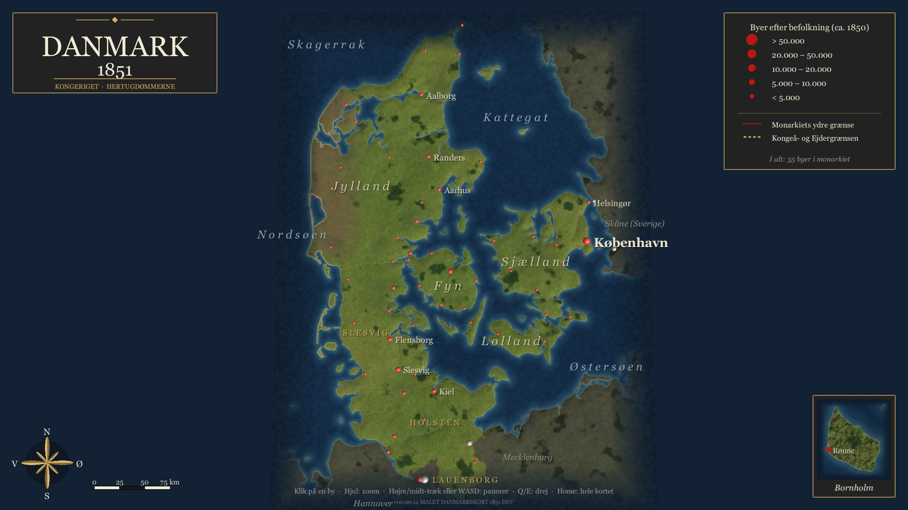
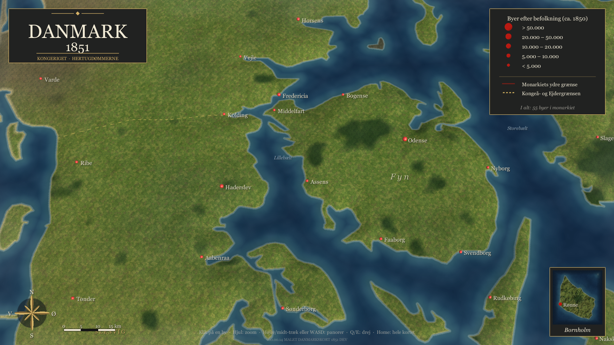

# PROJECT 1864 Campaign v00.00.14 — MALET DANMARKSKORT 1851

Status: DEV / MAP-ONLY / kanal `channel-campaign5` / batch-rendereret QA i Unity 6000.6.0f1, afventer Play Mode-QA på brugerens maskine.

## Hovedændring

Nyt, selvstændigt kampagnekort i malet kartografisk stil (jf. referencebillederne "DANMARK 1851") i en egen scene `CampaignMap1851`. Det eksisterende `CampaignMap` (v10–v13n inkl. Cesium) er uændret; de ca. 25 legacy-lag gater alle på scenenavnet `CampaignMap` og starter derfor ikke i den nye scene.

## Implementeret

- `tools/map1851/build_map.py` genererer kortet fra Natural Earth 10m (public domain):
  - kystlinjer, nabolande og Slesvig-Holstens grænser;
  - **monarkiet 1851**: Kongeriget, Hertugdømmet Slesvig og Holsten/Lauenborg, adskilt ved Kongeåen og Ejderen (stiplet guld) med monarkiets ydre grænse i mørkerød; Als, Ærø og Rømø klassificeres som Slesvig;
  - anakronismer fjernet: Rømødæmningen (1948) og Hindenburgdamm (1927);
  - malet land: markmosaik, skove (inkl. Rold, Silkeborg, Gribskov, Almindingen m.fl.), vestjysk hede, klitter, bakkeskygge;
  - hav med lys kystzone og dybt navy offshore; blød kant mod baggrunden;
  - fliselagt markdetalje (levende hegn) til tæt zoom, maskeret til monarkiets land;
  - Bornholm som indsat kort.
- `tools/map1851/cities1850.json`: 55 byer i monarkiet + 4 udenlandske referencebyer, befolkning ca. 1850 (**afrundede estimater, skal kildetjekkes**). Flensborg og Altona er med som blandt monarkiets største byer.
- Unity (`Assets/Campaign1851`):
  - `CampaignMap1851`: terræn-mesh (1 enhed = 1 km) med let overdrevet relief, lys, røde byprikker efter befolkning, klik for byinfo;
  - `CampaignMap1851Camera`: næsten lodret overblik → skråt 3/4-view ved zoom; WASD/højre-/midt-træk panorerer, hjul zoomer mod cursor, Q/E drejer, Home nulstiller;
  - `CampaignMap1851Ui`: titelkartouche, signaturforklaring, kompas, målestok, Bornholm-indsats, byinfo, sted-/hav-/regionsnavne med prioriteret kollisionshåndtering og zoomafhængig synlighed; skyer ved tæt zoom;
  - editor: menu `PROJECT 1864 > Open Campaign Map 1851 (malet kort)`, importindstillinger for korttexturerne, og batch-capture `CampaignMap1851Editor.CaptureCli`.
- `GrandCampaignBootstrap.CampaignModeEnabled` omfatter nu også `CampaignMap1851`, så den taktiske slagmark ikke bygges ind i kampagnekortet. Scenen indeholder desuden en `GrandCampaignBootstrap`-markør.

## Ikke ændret

- `CampaignMap` (v13n Cesium) og alle v10–v13-lag.
- Campaign simulation, bevægelse, logistik, OOB.
- Tactical TEST.

## Kendte forhold

- Den globale `JsonUtility`-shim fra v13k1 understøtter kun strenge; det nye kort kalder eksplicit `UnityEngine.JsonUtility`.
- Befolkningstal og enkelte grænseforløb (Kongeå, Ejder) er approksimationer.
- Skove er stadig bløde ved tæt zoom; byer er prikker (ingen 3D-byer endnu).
- Kortet er rent visuelt: det er endnu ikke koblet til `CampaignSession`-noder, hære eller ordrer.

## QA

1. Åbn via `PROJECT 1864 > Open Campaign Map 1851 (malet kort)` og tryk Play.
2. Hele monarkiet fra Skagen til Lauenborg skal ses ved start; ingen hård kant om kortet.
3. Bynavne sidder ved deres prikker og overlapper ikke; flere byer dukker op ved zoom.
4. Kongeå- og Ejdergrænsen er stiplet guld; ingen stiplet linje på Sundeved/Als.
5. Klik på en by viser navn, status, region og indbyggertal.
6. Ingen tactical-UI, slagmark eller gamle kortlag må vise sig.

